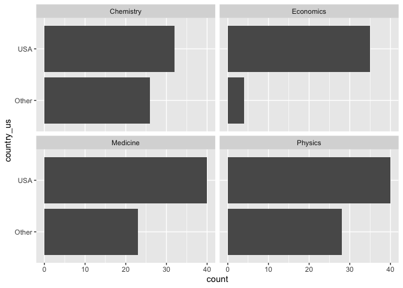

Lab 03 - Nobel laureates
================
Marq Schieber
2/14

### Load packages and data

``` r
library(tidyverse) 
```

``` r
nobel <- read_csv("data/nobel.csv")
```

## Exercises

### Exercise 1

``` r
count(nobel)
```

    ## # A tibble: 1 × 1
    ##       n
    ##   <int>
    ## 1   935

``` r
ncol(nobel)
```

    ## [1] 26

There are 935 observations and 26 variables. Each row represents one
observation.

There are some observations in this dataset that we will exclude from
our analysis to match the Buzzfeed results.

### Exercise 2

``` r
new_nobel <- nobel %>%
filter(country!='NA',
       gender!='org',
       is.na(died_date))
```

WHoops called the new data frame new_nobel.

### Exercise 3

``` r
new_nobel <- new_nobel %>%
  mutate(
    country_us = if_else(country == "USA", "USA", "Other")
  )
```

``` r
nobel_living_science <- new_nobel %>%
  filter(category %in% c("Physics", "Medicine", "Chemistry", "Economics"))
```

### Exercise 4

Create a faceted bar plot visualizing the relationship between the
category of prize and whether the laureate was in the US when they won
the nobel prize. Interpret your visualization, and say a few words about
whether the Buzzfeed headline is supported by the data.

Your visualization should be faceted by category. For each facet you
should have two bars, one for winners in the US and one for Other. Flip
the coordinates so the bars are horizontal, not vertical.

``` r
ggplot(data = nobel_living_science, aes(y = country_us)) +
  geom_bar() +
  facet_wrap(~ category)
```

<!-- -->

Maybe I’m misunderstanding, but I don’t see how this visualization
relates to the buzzfeed article. This graph shows US winners vs. outside
foreign winners. The buzzfeed article was focused on solely US winners,
albeit those who were born in the US and those who immigrated here.

With that said, this article shows that a significant amount of
intellectual talent can be found outside of the United States. This adds
support to the article’s assertion that the US has much to gain (above
what it’s already gained) from importing researchers.

…

### Exercise 5

…

### Exercise 6

…
